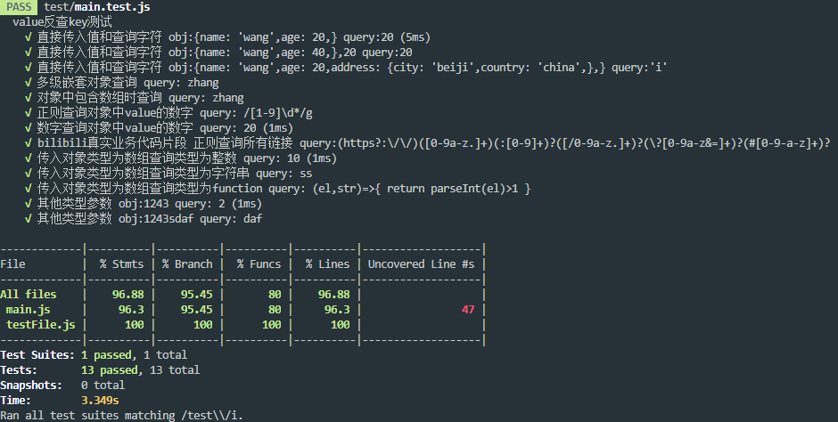

# npm Jest环境示例

> JEST是一个优雅的JavaScript测试框架，侧重于简单性。他可以在`babe`,`Typescript`,`Node`,`React`,`Angular`,`Vue`甚至更多项目中使用

## 安装
配置过程

### 安装Jest 
`npm install jest --save-dev`
### 使用方法
 
先在您的项目目录下的`/src`路径中创建需要测试的模块 `add.js`内容为

```js
module.exports = add = (a,b)=>a+b;
```

创建脚本测试目录 `test` 脚本文件命名为 <模块名>.test.js 
```js
// 示例test脚本文件内容
const add = require('../src/add')

describe("加法函数测试",()=>{
    test("1+1等于2",()=>{
        expect(add(1,1)).toBe(2)
    })
})
```
在 `package.json`中配置如下测试命令
```json
"scripts": {
    "test-jest": "jest test-jest/"
}
```
运行`npm run test-jest`即可获得测试结果

## 覆盖统计
jest内置覆盖统计,为了更方便的进行相关配置,我们需要先在项目目录下`同package.json`创建一个配置文件`jest.config.js`
```js
// 示例jest配置文件内容
module.exports = {
    // 开启覆盖统计功能
    collectCoverage: true,
    // 将要覆盖的文件
    collectCoverageFrom: ["src/*.js"],
    // 输出覆盖统计结果的目录
    coverageDirectory: "test/coverage/",
    // 测试脚本路径
    testMatch: ["**/test/*.test.js"]
};
```
然后将`package.json`中的命名修改一下`"test-jest": "jest"`再次运行即可获得统计结果

参考代码
```js
/**
 *
 * @param {object|Array} obj 传入需要查询的对象,数组
 * @param {String|Number|RegExp|function} query 传入查询的字符,数字,正则,方法
 */
const valueFind2 = (obj, query) => {
  const [rearr, path] = [[], []];
  let count = 0;
  let fn = () => {};
  // 检测传入的query的类型 Number会被转化为String,reg则转化为reg.test方法,function则继承function
  typeof query === "function"
    ? (fn = query)
    : typeof query === "object"
    ? (fn = (element, query) => query.test(element + ""))
    : (fn = (element, string) => ("" + element).indexOf("" + string) >= 0);
  // 递归查询传递对象|数字
  const findvalue = (object, query) => {
    const obj = object;
    for (const key in obj) {
      if (obj.hasOwnProperty(key)) {
        const el = obj[key];
        if (typeof el === "object") {
          // 判断即将写入的路径是否在path的栈底
          path[0] === undefined
          // 在栈底且当传入的对象是一个数字
            ? Array.isArray(object)
              ? path.push("[" + key + "]")
              : path.push("" + key)
            : path.push("." + key); 
          findvalue(el, query);
          // 从递归出来后弹出栈顶路径
          path.pop();
        } else if (fn(el, query)) {
          Array.isArray(obj)
            ? // 当前类型为数组时,返回数组的下标
              (rearr[count] = path.join("") + "[" + key + "]")
            : // 当前类型为string || number 时,返回对象路径
              (rearr[count] =
                path.join("") + (path.length > 0 ? "." : "") + key);
          // 每寻找到一个符合条件的
          ++count;
        }
      }
    }
    return
  };
  findvalue(obj, query);
  return rearr;
};
module.exports = valueFind2;
```
ts版本在`src/main.ts`中,最先使用ts实现,随后编写为js
# 运行jest测试

`git clone https://github.com/moshuying/workSpace.git`

`npm install --registry https://registry.npm.taobao.org && npm run test`

jest运行结果

